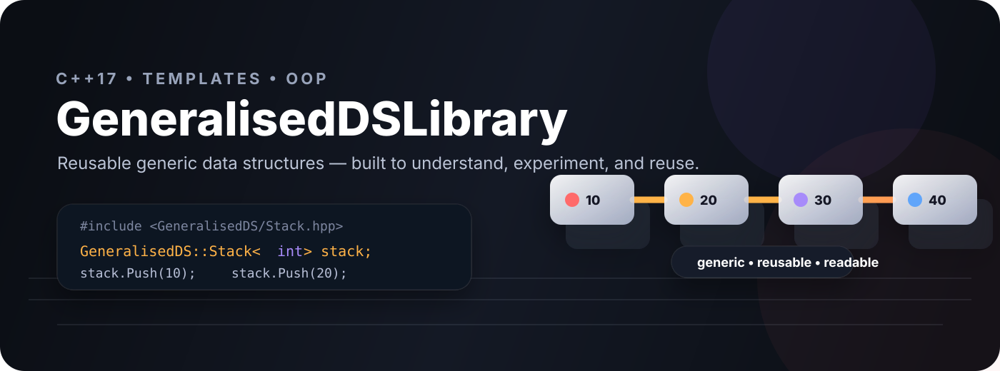
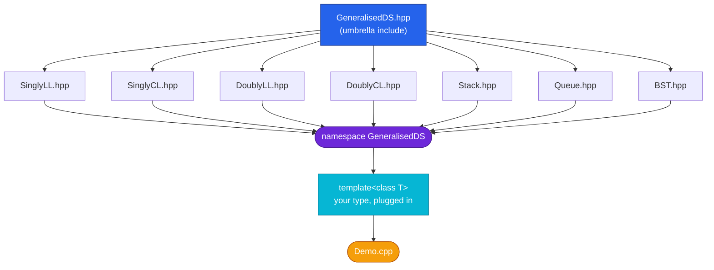

<div align="center">




<br/>

[](https://en.cppreference.com/w/cpp/17)
[](#-project-structure)
[](LICENSE)
[](#-data-structures)
[](https://github.com/rushikeshspuri)

<br/>

**One `#include`. Any type. Seven battle-tested data structures — built from raw pointers, no STL crutches.**


</div>

<br/>

<div align="center">

### 🎬 Demo

<a href="assets/demo.mp4">
  
</a>

<sub>GIF preview above autoplays — click it (or <a href="assets/demo.mp4">this link</a>) to watch the full demo video with sound.</sub>

</div>

<br/>

<div align="center">

### 📌 Table of Contents

</div>

- [🎬 Demo](#-demo)
- [🚀 Overview](#-overview)
- [🧩 Data Structures](#-data-structures)
- [⚡ Complexity Cheat Sheet](#-complexity-cheat-sheet)
- [🏗️ Architecture](#️-architecture)
- [📂 Project Structure](#-project-structure)
- [🛠️ Getting Started](#️-getting-started)
- [💻 Usage](#-usage)
- [🎯 Design Philosophy](#-design-philosophy)
- [🗺️ Roadmap](#️-roadmap)
- [👤 Author](#-author)

<br/>

## 🚀 Overview


**GeneralisedDS** is a **header-only C++17 library** that reimplements the classic data-structure canon — linked lists, stacks, queues, and trees — as clean, reusable, **templated** classes.

No `void*` casts. No copy-pasting the same linked-list logic for every type you need. Drop a header in, instantiate with any type `T`, and you have a fully working, type-safe container.

> 🧠 Built as a deliberate deep-dive into **pointers, dynamic memory, templates, and OOP** — the goal wasn't to reinvent `std::vector`, it was to *understand* what `std::vector` is hiding from you.

<br clear="right"/>

## 🧩 Data Structures

<table width="100%">
<tr>
<td width="33%" valign="top">

### 🔗 Linked Lists
- Singly **Linear** Linked List
- Singly **Circular** Linked List
- Doubly **Linear** Linked List
- Doubly **Circular** Linked List

</td>
<td width="33%" valign="top">

### 📚 Linear Structures
- **Stack** — `Push / Pop / Peep`
- **Queue** — `Enqueue / Dequeue`

</td>
<td width="33%" valign="top">

### 🌳 Trees
- **Binary Search Tree**
  - In / Pre / Post-order
  - Leaf & parent node counts

</td>
</tr>
</table>

<details>
<summary><b>🔍 Click to expand full public API per structure</b></summary>

<br/>

**`SinglyLL<T>` / `DoublyLL<T>`**
```cpp
InsertFirst(T)  InsertLast(T)  InsertAtPos(T, int)
DeleteFirst()   DeleteLast()   DeleteAtPos(int)
Display()       Count()
```

**`SinglyCL<T>` / `DoublyCL<T>`** — same API as above, `first`/`last` wrap into a ring

**`Stack<T>`**
```cpp
Push(T)   Pop()   Peep()   Display()   Count()
```

**`Queue<T>`**
```cpp
Enqueue(T)   Dequeue()   Display()   Count()
```

**`BST<T>`**
```cpp
Insert(T)     Search(T)
Inorder()     Preorder()     Postorder()
Count()       CountLeaf()    CountParent()
```

</details>

<br/>

## ⚡ Complexity Cheat Sheet

Honest Big-O — including the traversal costs of nodes that don't carry a tail pointer:

| Structure | InsertFirst | InsertLast | InsertAtPos | DeleteFirst | DeleteLast | Notes |
|---|:---:|:---:|:---:|:---:|:---:|---|
| `SinglyLL` | O(1) | O(n) | O(n) | O(1) | O(n) | no tail pointer |
| `SinglyCL` | O(1) | **O(1)** | O(n) | O(1) | O(n) | tail pointer, ring-linked |
| `DoublyLL` | O(1) | O(n) | O(n) | O(1) | O(n) | no tail pointer |
| `DoublyCL` | O(1) | **O(1)** | O(n) | O(1) | **O(1)** | tail pointer + `prev` link |
| `Stack` | — | — | — | **O(1)** `Pop` | — | LIFO, top = `first` |
| `Queue` | — | O(n) `Enqueue` | — | **O(1)** `Dequeue` | — | no tail pointer |
| `BST` | `Insert` avg **O(log n)**, worst O(n) | | | | | unbalanced |

> 💡 `SinglyCL` and `DoublyCL` keep an explicit `last` pointer, so tail insertion is O(1) — the linear variants don't, which is exactly the kind of trade-off this project was built to make visible.

<br/>

## 🏗️ Architecture



Every container lives inside `namespace GeneralisedDS`, is declared as `template <class T>`, and ships as a single `.hpp` — include only what you use, or pull in `GeneralisedDS.hpp` for everything at once.

<br/>

## 📂 Project Structure

```text
GeneralisedDSLibrary/
├── assets/
│   ├── generalised-ds-hero.svg  # README banner
│   ├── generalised-ds-poster.png
│   ├── demo-preview.gif         # looping preview of demo.mp4
│   └── demo.mp4                 # full walkthrough video
├── include/
│   └── GeneralisedDS/
│       ├── GeneralisedDS.hpp   # umbrella header
│       ├── SinglyLL.hpp        # Singly Linear Linked List
│       ├── SinglyCL.hpp        # Singly Circular Linked List
│       ├── DoublyLL.hpp        # Doubly Linear Linked List
│       ├── DoublyCL.hpp        # Doubly Circular Linked List
│       ├── Stack.hpp
│       ├── Queue.hpp
│       └── BST.hpp
├── examples/
│   └── Demo.cpp                # drives every structure
├── LICENSE                     # MIT
└── README.md
```

<br/>

## 🛠️ Getting Started

<table>
<tr><td>

**Requirements:** a C++ compiler with **C++17** support (`g++`, `clang++`, or MSVC).

</td></tr>
</table>

```bash
# 1. Clone it
git clone https://github.com/rushikeshspuri/GeneralisedDSLibrary.git
cd GeneralisedDSLibrary

# 2. Compile the demo — header-only, just point -I at include/
g++ -std=c++17 examples/Demo.cpp -I include -o Demo

# 3. Run it
./Demo
```

No build system, no dependencies, no linking — just headers. Drop `include/GeneralisedDS` into any project and go.

<br/>

## 💻 Usage

```cpp
#include <GeneralisedDS/Stack.hpp>
#include <GeneralisedDS/Queue.hpp>
#include <GeneralisedDS/BST.hpp>

int main()
{
    // Works with any type — int, double, std::string, your own class
    GeneralisedDS::Stack<int> stack;
    stack.Push(10);
    stack.Push(20);
    stack.Display();          // 20 10

    GeneralisedDS::Queue<std::string> queue;
    queue.Enqueue("first");
    queue.Enqueue("second");
    std::cout << queue.Dequeue();   // "first"

    GeneralisedDS::BST<int> tree;
    tree.Insert(50);
    tree.Insert(30);
    tree.Insert(70);
    tree.Inorder();           // 30 50 70
}
```

<br/>

## 🎯 Design Philosophy

<div align="center">

| Principle | How it shows up |
|---|---|
| 🧬 **Generic over specific** | Every container is `template <class T>` — one implementation, any type |
| 🧱 **One header, one job** | Each data structure is fully self-contained in its own `.hpp` |
| 🎛️ **Manual memory, on purpose** | Raw `new`/`delete` and pointer wiring, no `std::` containers hiding the mechanics |
| 🔍 **Transparent complexity** | Structures expose their real trade-offs (see the table above) instead of pretending they're all O(1) |

</div>

This library exists to practice — and prove — an understanding of **pointers, dynamic memory, linked structures, and object-oriented API design** in C++, one data structure at a time.

<br/>

## 🗺️ Roadmap

- [x] Singly & Doubly Linked Lists (linear + circular)
- [x] Stack & Queue
- [x] Binary Search Tree
- [ ] AVL / self-balancing tree
- [ ] Hash table
- [ ] Iterator support (range-based `for`)
- [ ] Unit tests

<br/>

## 👤 Author

<div align="center">

### Rushikesh Puri

[](https://github.com/rushikeshspuri)

<sub>Built to *actually understand* the data structures — not just pass the interview question about them.</sub>

<br/><br/>


</div>
